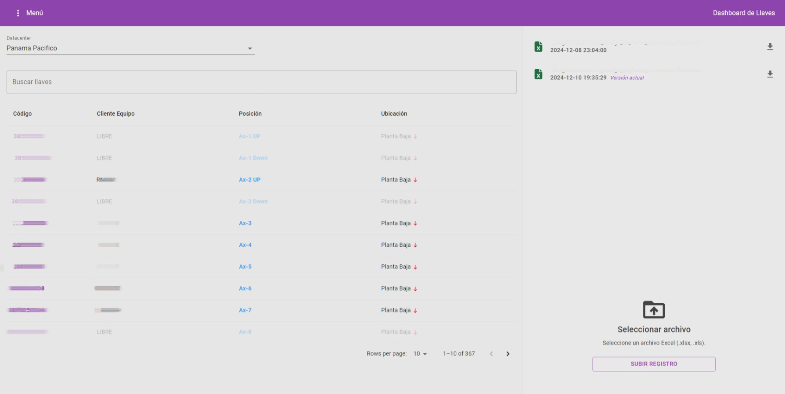
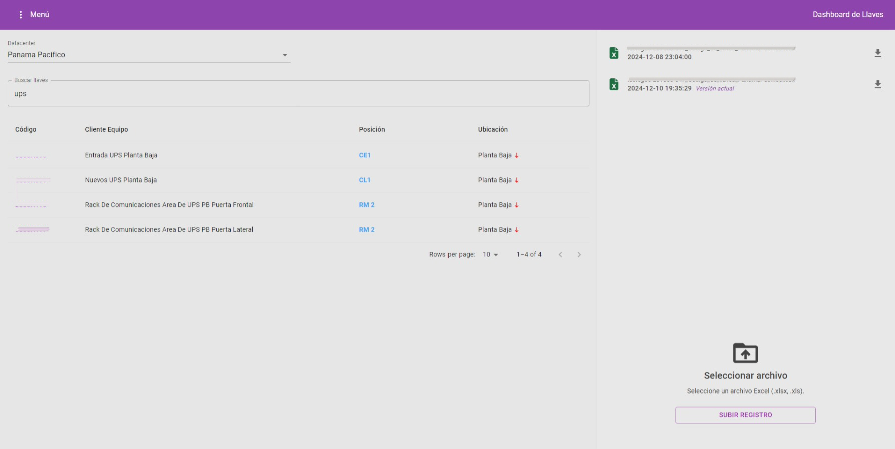
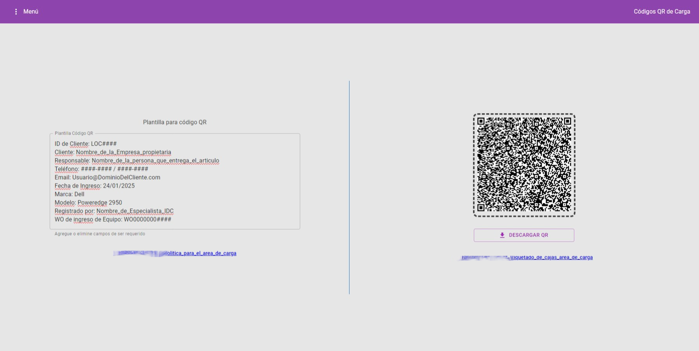

# React Project: Key Lookup and QR Labeling Tool

A React-based application designed for efficient key lookup, QR code generation, and labeling for private use.

---

## Description

The Key Lookup and QR Labeling Tool is a specialized application designed to streamline the process of managing keys, generating QR codes, and labeling boxes. It enables users to upload key data from Excel files, store it in a MySQL database, and generate QR codes for easy tagging and retrieval. This application is built with a modern tech stack, ensuring fast performance and a seamless user experience.

---

## Features

- Upload key data from Excel files to a MySQL database.
- Search and retrieve key information efficiently.
- Generate and download QR codes for labeling boxes.
- Responsive and user-friendly interface built with MUI-Material.
- Single Page Application (SPA) architecture for a smooth user experience.
- React Router DOM for seamless navigation between the key lookup and QR code sections.
- Utilization of React hooks for state management and component lifecycle handling.
- Context API for efficient key data management across the application.
- Secure data management with a PHP backend.

---

## Installation

To run this project locally, follow these steps:

1. Clone the repository:

   ```bash
   git clone https://github.com/CWB-Datacenter/dashboard-llaves
   ```

2. Navigate to the project directory:

   ```bash
   cd dashboard-llaves
   ```

3. Install dependencies:

   ```bash
   npm install
   ```

4. Start the development server:

   ```bash
   npm run dev
   ```

The application will run on a local development server, typically accessible at http://localhost:5173.

---

## Project Structure
```
📂 Dashboard-Llaves/
├── 📁 public/                # Static files (index.html)
├── 📁 src/
│   ├── 📁 components/        # Reusable components
│   │   ├── 📁 Archivos/      # Components for file management
│   │   │   ├── 📄 CargarArchivos.jsx
│   │   │   └── 📄 ListarArchivos.jsx
│   │   ├── 📁 Llaves/        # Components for key management
│   │   │   ├── 📄 InputSelectIDC.jsx
│   │   │   ├── 📄 KeyResults.jsx
│   │   │   └── 📄 MainContent.jsx
│   │   ├── 📁 QRCarga/       # Components for QR generation
│   │   │   ├── 📄 Formulario.jsx
│   │   │   └── 📄 QRCode.jsx
│   │   ├── 📄 InputSearch.jsx
│   │   ├── 📄 Navbar.jsx
│   │   ├── 📄 PageTitle.jsx
│   │   └── 📄 Spinner.jsx
│   ├── 📁 context/           # Application state management (Context API)
│   │   ├── 📁 Llaves/        # Context for key management
│   │   │   ├── 📄 keysActions.js
│   │   │   ├── 📄 KeysContext.jsx
│   │   │   └── 📄 keysReducer.js
│   │   ├── 📄 datacenterActions.js
│   │   ├── 📄 DatacenterContext.jsx
│   │   └── 📄 datacenterReducer.js
│   ├── 📁 helpers/           # Utility functions
│   │   └── 📄 date.js
│   ├── 📁 Pages/             # Page components
│   │   ├── 📄 LlavesPage.jsx
│   │   └── 📄 QRCargaPage.jsx
│   ├── 📁 router/            # Routing configuration
│   │   └── 📄 AppRouter.jsx
│   ├── 📄 App.css
│   ├── 📄 App.jsx
│   ├── 📄 index.css
│   └── 📄 main.jsx          # Application entry point
├── 📄 .gitignore
├── 📄 @eslint.config.js
├── 📄 index.html
├── 📄 package-lock.json
├── 📄 package.json
├── 📄 README.md
├── 📄 server.js             # Server file (if applicable)
└── 📄 vite.config.js
```
---

## Available Scripts

- `npm run dev`: Runs the app in development mode.
- `npm run build`: Builds the app for production.
- `npm run preview`: Previews the built application.

---

## Technologies Used

# Frontend:
- React with Vite: Fast and modern frontend development.
- MUI-Material: For responsive and accessible UI components.
- React Router DOM: For client-side navigation.
- Context API: For global state management.
- React Hooks: For functional, clean, and reusable components.
# Backend:
- PHP: For server-side processing and database interaction.
- MySQL: For secure and efficient data storage.

---

## License

This project is licensed under the MIT License. See the `LICENSE` file for more details.

---

## Contact

- **Author**: [AbdielP](https://github.com/Abdielp)
- **Email**: [abdiel.pinzonc@gmail.com](mailto\:abdiel.pinzonc@gmail.com)
- **GitHub**: [https://github.com/Abdielp](https://github.com/Abdielp)

---

## Screenshots

### Dashboard keys View


### Dashboard keys - search feature


### Dashboard QR Code View


### QR Code


Feel free to reach out if you have any questions or suggestions!


